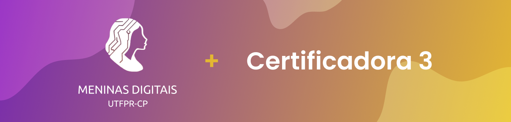

# Certificadora 1



<br>

Este projeto será composto pelo desenvolvimento de um sistema web com o objetivo de simplificar o agendamento e controle de minicursos e oficinas ofertados pelo projeto Meninas Digitais.

<br>

## 👨‍💻 Equipe (grupo 2)

- Gabriela Maria Lieira

- Gabrielle Avelino Saad do Bonfim

- Talita Aya Sakamoto Kuriki

<br>

## 📑 Funcionalidades

<b>❗ O back-end do projeto ainda não foi implementado, visto que esta entrega seria a finalização completa do front-end, deste modo, nenhuma informação está sendo salva no sistema atual, não é necessário credeciais para realizar login (basta clicar no botão 'Entrar') e não há nenhuma conexão, até então, com o banco de dados que será utilizado ❗</b> 

1. Apresentação Geral de todos os minicursos e oficinas planejados, de modo que toda a comunidade interessada possa ter acesso;

2. Tela Saiba Mais com detalhes do minicurso/oficina selecionado: descrição, data, hora, local, duração e certificação;

    > Tela acessada ao clicar no card de algum minicurso/oficina da Tela de Apresentação Geral

3. O público poderá se inscrever no minicurso/oficina que desejar através de um formulário externo, cujo link sera disponibilizado no sistema proposto através de um botão claro e objetivo que indica a ação citada;

4. Área privada dos admnistradores (integrantes do projeto Meninas Digitais) que só poderá ser acessada com o e-mail e senha cadastrados;
    
    > Login restritivo para que a comunidade externa não tenha acesso

5. Tela privada com a apresentação geral e opções para o administrador cadastrar, visualizar, editar e excluir um minicurso/oficina;

    > Acessível se, e somente, o usuário conseguir realizar o login para a área privada dos administradores

<br> 


## 💻 Desenvolvimento:

Para o desenvolvimento do sistema, optou-se por utilizar o framework [React JS](https://pt-br.legacy.reactjs.org), em sua versão mais recente 18.2.0, para a construção Front-end da aplicação, visando uma melhor experiência do usuário. 

Juntamente, utilizou-se da biblioteca [Material UI](https://mui.com) na versão 5.15.15, a qual oferece diferentes componentes que auxiliaram na construção das interfaces do sistema, com o [React Router Dom](https://reactrouter.com/en/main), na versão 6.23.0, para controle de rotas e desenvolvimento de uma aplicação padrão SPA (Single Page Application).

  

Para a lógica do projeto será utilizado o BaaS (Backend As A Service) [Firebase](https://firebase.google.com/products-build?hl=pt), um modelo de serviço que oferece a infraestrutura e o back-end de uma aplicação de forma simplificada e que será implementado para a próxima entrega do projeto no dia 08 de junho de 2024.

  

Já o progresso do projeto foi acompanhado através de uma [Planilha Gantt](https://blog.runrun.it/planilha-de-gantt/#:~:text=O%20gr%C3%A1fico%20de%20gantt%20%C3%A9,a%20produtividade%20da%20sua%20%C3%A1rea.), contendo os status de todas as tarefas pendentes, os responsáveis, datas de início e fim, bem como estregas parciais e finais. Este cronograma completo pode ser visualizado através deste [link](https://docs.google.com/spreadsheets/d/1ch29nuDN0-2P2YCQSGXyLf8QUYjbYn0F/edit?usp=sharing&ouid=112152257061659035144&rtpof=true&sd=true).

  
<br>

## 🎨 Design:

A interface do projeto foi projetada utilizando a ferramenta [Figma](https://www.google.com/url?sa=t&rct=j&q=&esrc=s&source=web&cd=&ved=2ahUKEwitvZDQr7mBAxUepZUCHXgoBgIQFnoECAcQAQ&url=https://www.figma.com/&usg=AOvVaw2ixWJnr7CgjXMg3QXfTz4u&opi=89978449), esta que permitiu criar um arquivo compartilhável e um protótipo do que seria desenvolvido, facilitando o entendimento geral, certificando que todos os requisitos e regras seriam seguidos e permitindo a estilização do sistema para uma interface amigável.

  

Deste modo, o design pode ser acessado através deste [link](https://www.figma.com/file/7ODflqzaYbwreyfpwY6Z5l/Certificadora-3?type=design&node-id=4%3A4320&mode=design&t=NyQIQHbHquTtdAI0-1).

  
  
<br>

## 📥 Instalação e execução

1. Clonar o projeto em seu próprio computador

```
//git clone <link do repositório>

git clone https://github.com/talita-aya/certificadora-3.git
```
2. Abrir a pasta do projeto em seu editor de código


3. Instalar todas as dependências do projeto

    3.1. Esta etapa pode ser feita no terminal do projeto

        Ex: No Visual Studio Code basta utilizar o atalho Ctrl + J

```
npm i

//ou

npm install
```

4. Executar o projeto

```
npm start start
```


O sistema será aberto em uma nova página de seu navegador, sendo possível o uso da aplicação e suas funcionalidades.